# C++ & C# Browser

C++&C# Browser is a browser development framework based on the Chromium open source project. The goal of the project is to enable C++ and .NET developers to build their own browsers using C++ and .NET desktop technology and build hybrid web pages based on C++, .NET, and Web. C++&C# Browser has two editions, one is open-source, another is commercial, detail information please visit our GitHub (https://github.com/TangramDev) and our website (https://www.tangram.dev).

## How to work?

C++&C# Browser enables developers to run desktop components (include MFC/WinForm/WPF) in the browser tab window, use desktop components to occupy the entire tab window or make desktop components and web pages share window area in a grid layout. Desktop components can communicate with web pages and other components. Developers can use HTML to drive these desktop components.

To experience the C++&C# Browser, you first need to make sure your computer is Windows 7, Windows 8.1 or Windows 10. Download and extract the preview package to any location. The package includes sample programs for WinForm, WPF, and MFC, named MyCSharpBrowserN, MyWpfBrowserN, and MyCxxBrowserN, respectively. Run each program and you will see


C# UserControl/Form and New Tab Page.

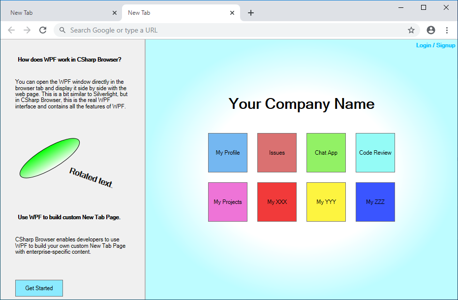

WPF UserControl and New Tab Page.

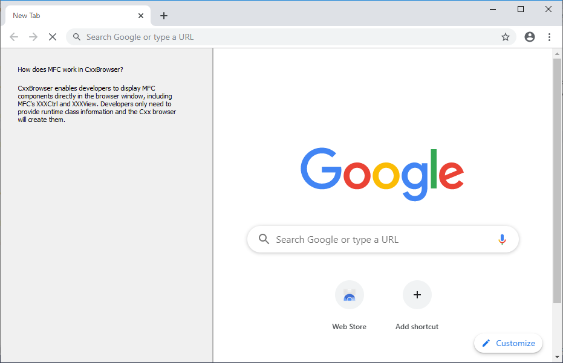

MFC FormView and New Tab Page.


WinForm is displayed on a single page.

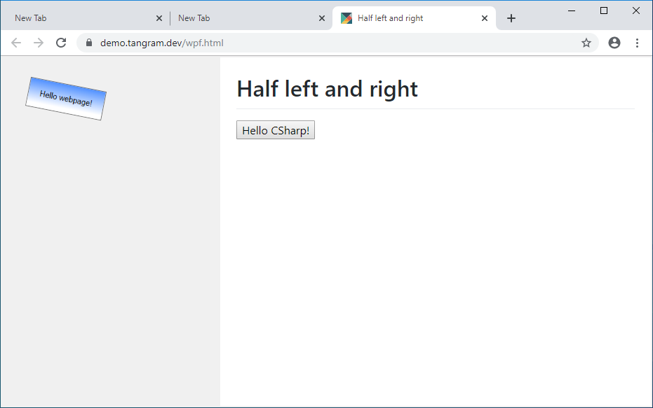

WPF is displayed on a single page.

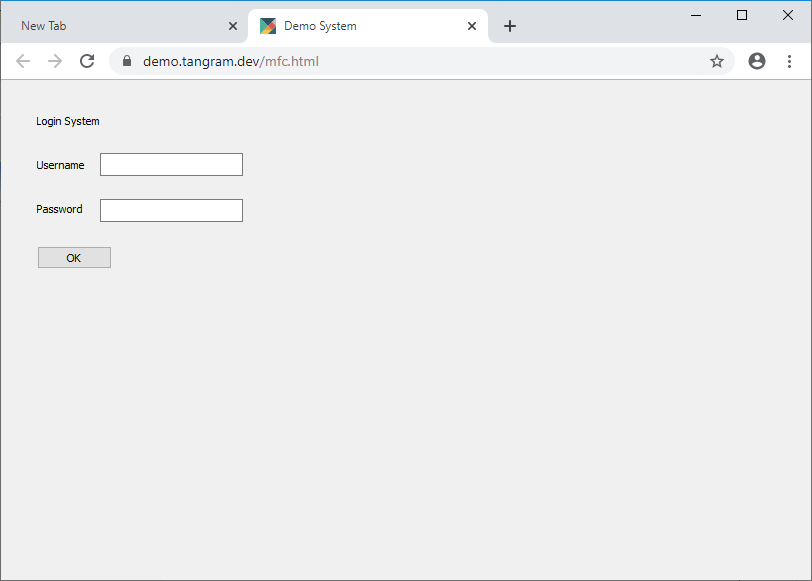

MFC is displayed on a single page.


IPC between WinForm and web pages.


IPC between WPF and web pages.

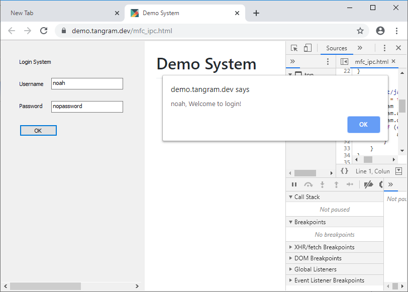

IPC between MFC and web pages.

## How to build your own browser?

C++&C# Browser enables developers to build their own browsers using WinForm, WPF, and MFC. You first need a computer with Windows 10 and Visual Studio 2019 installed. The following Visual Studio installation items are essential.

- .NET desktop development
- Desktop development with C++ (Required if develop with C++)
  - Visual C++ MFC for x86 and x64
  - C++/CLI support

Also make sure you have the latest version of the Windows SDK installed. 

Download [tangram_runtime_chromium_78_1.0.1.zip](https://github.com/TangramDev/tangram_runtime_binaries/releases/download/v1.0.0/tangram_runtime_chromium_78_1.0.0.zip) and extract it to the `C:\src` directory.


You can create three types of projects.

- [Windows Forms App (.NET Framework)](Cxx_and_CSharp_Browser.md#winform)
- [WPF App (.NET Framework)](Cxx_and_CSharp_Browser.md#wpf)
- [MFC App](Cxx_and_CSharp_Browser.md#mfc)

Please choose one you are familiar with.

### [Windows Forms App (.NET Framework)](#winform)

Create a Windows Forms App (.NET Framework) project using Visual Studio. And reference to `tangram_clr_rt.dll`(Located at `C:\src\tangram_runtime_chromium_78_1.0.0\`).


Change platform target to x64.


Update the Output path to `C:\src\tangram_runtime_chromium_78_1.0.0\`.


Use Tangram to take over the WinForm message loop.

```c#
using TangramCLR;

...

static void Main()
{
    Application.EnableVisualStyles();
    Application.SetCompatibleTextRenderingDefault(false);
    Application.Run(Tangram.Context); // !Important
}
```

Build and run the WinForm program.


A Chromium window will open. Next, we add the following code to customize the New Tab Page.

```c#
Tangram.UpdateNewTabPageLayout("Default.xml"); // New line
Application.Run(Tangram.Context);
```

UpdateNewTabPageLayout needs to pass in an XML file, similar to the following:

```xml
<?xml version="1.0" encoding="utf-8" ?>
<ntp>
  <window>
    <node id='splitter' name='splitter' rows='1' cols='2' height='250,' width='350,100,' borderwidth='0' splitterwidth='2' middlecolor='RGB(180,180,180)'>
      <node id="clrctrl" cnnid="MyCSharpBrowser.Form1,host"></node>
      <node id="hostview"></node>
    </node>
  </window>
</ntp>
```

Save this XML as a file named `Default.xml` and copy it to the `C:\src\tangram_runtime_chromium_78_1.0.0\Default.xml`, Remember to update the `cnnid` in this XML.

Build and run the WinForm program again.


The Form1 will be displayed on the left side of the browser window. Take a look at Form1.


### [WPF App (.NET Framework)](#wpf)

Create a WPF App (.NET Framework) project using Visual Studio. And reference to `tangram_clr_rt.dll`(Located at `C:\src\tangram_runtime_chromium_78_1.0.0\`).

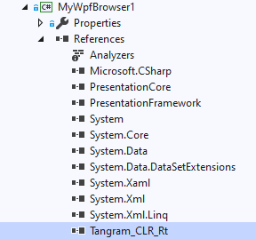

Change platform target to x64.

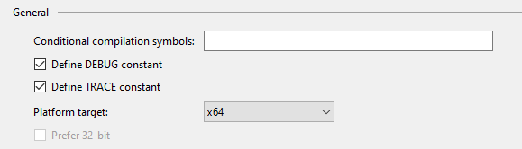

Update the Output path to `C:\src\tangram_runtime_chromium_78_1.0.0\`.

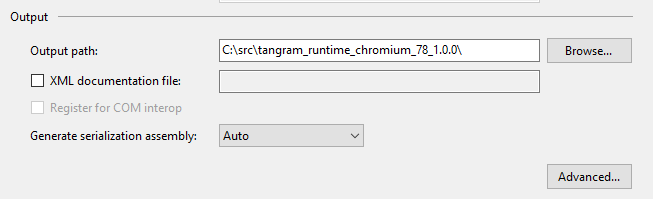

The WPF project does not explicitly include the `Main` function by default. Developers need to delete the `App.xaml` and the `App.xaml.cs` and add a `Program` class file similar to the following:

```c#
using System;
using System.Collections.Generic;
using System.Linq;
using System.Text;
using TangramCLR;

namespace MyWpfBrowser
{
    class Program
    {
        // All WPF applications should execute on a single-threaded apartment (STA) thread
        [STAThread]
        public static void Main()
        {
            WpfApplication app = new WpfApplication();
            app.Run();
        }
    }
}
```

Build and run the WPF program.

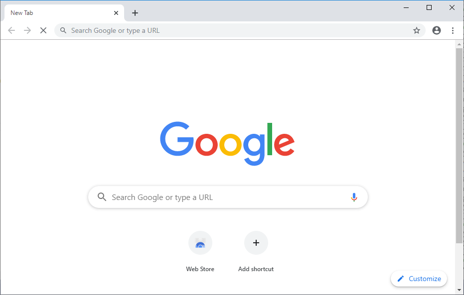

A Chromium window will open. Next, we add the following code to customize the New Tab Page.

```c#
WpfApplication app = new WpfApplication();
Tangram.UpdateNewTabPageLayout("Default_Wpf.xml"); // New line
app.Run();
```

UpdateNewTabPageLayout needs to pass in an XML file, similar to the following:

```xml
<?xml version="1.0" encoding="utf-8" ?>
<ntp>
  <window>
    <node id='splitter' name='splitter' rows='1' cols='2' height='250,' width='350,100,' borderwidth='0' splitterwidth='2' middlecolor='RGB(180,180,180)'>
      <node id="clrctrl" cnnid="MyWpfBrowser.UserControl1,host"></node>
      <node id="hostview"></node>
    </node>
  </window>
</ntp>
```

Save the XML as a file named `Default_Wpf.xml` and copy it to the `C:\src\tangram_runtime_chromium_78_1.0.0\Default_Wpf.xml`, the `cnnid` requires a valid WPF UserControl, let's create a new one.

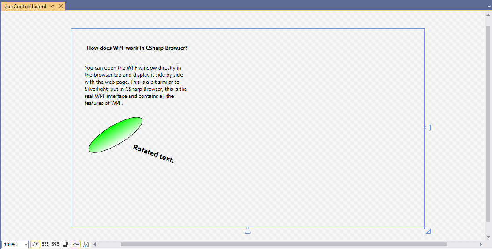

Build and run this WPF program again.

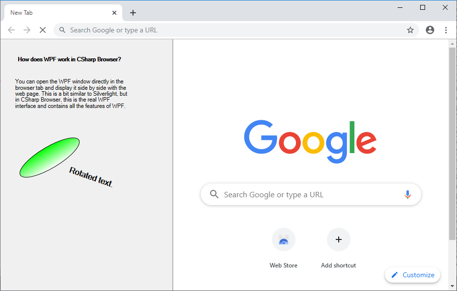

### [MFC App](#mfc)

Create a MFC App project using Visual Studio.

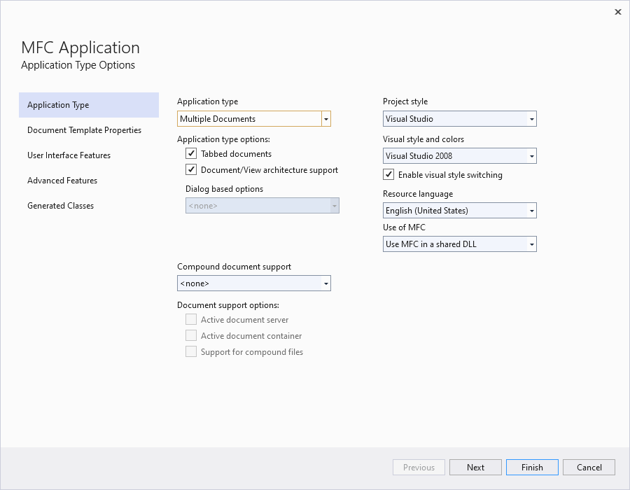

Application type is Multiple Documents.

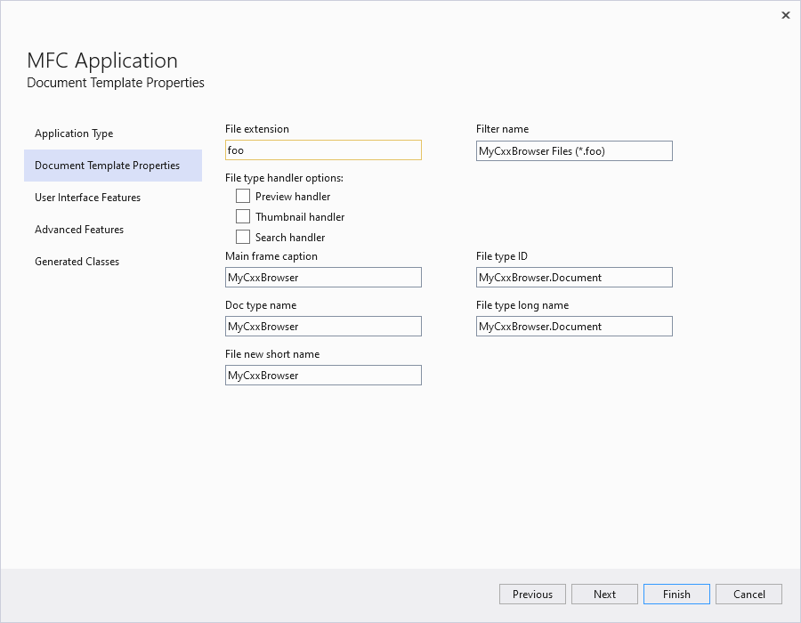

Any file extension, others are the default. 

Update the Output directory to `C:\src\tangram_runtime_chromium_78_1.0.1\`.

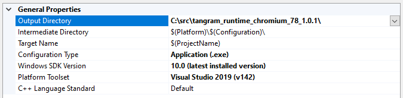

Add `C:\src\tangram_runtime_chromium_78_1.0.1\include` to Additional Include Directories.

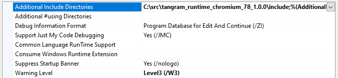

Add `TangramAppDelegate.h` and `TangramAppDelegate.cpp` to the `pch.h` and `pch.cpp` files.

```c++
// pch.h: This is a precompiled header file.
// Files listed below are compiled only once, improving build performance for future builds.
// This also affects IntelliSense performance, including code completion and many code browsing features.
// However, files listed here are ALL re-compiled if any one of them is updated between builds.
// Do not add files here that you will be updating frequently as this negates the performance advantage.

#ifndef PCH_H
#define PCH_H

// add headers that you want to pre-compile here
#include "framework.h"
#include "TangramAppDelegate.h" // New line
#include <afxext.h>

#endif //PCH_H

```

In pch.cpp

```c++
// pch.cpp: source file corresponding to the pre-compiled header

#include "pch.h"
#include "TangramAppDelegate.cpp" // New line

// When you are using pre-compiled headers, this source file is necessary for compilation to succeed.
```

Replace the App class's base class to `CTangramWinAppEx`.

```c++
// CMyCxxBrowserApp:
// See MyCxxBrowser.cpp for the implementation of this class
//

class CMyCxxBrowserApp : public CTangramWinAppEx // New base class
{
public:
	CMyCxxBrowserApp() noexcept;
```

Finally, modify the `InitInstance` function of the App class.

```c++
BOOL CMyCxxBrowserApp::InitInstance()
{
	...
	if (!__super::InitInstance())
		return false;
	//CWinAppEx::InitInstance();
	...
```

Build and run this MFC program.

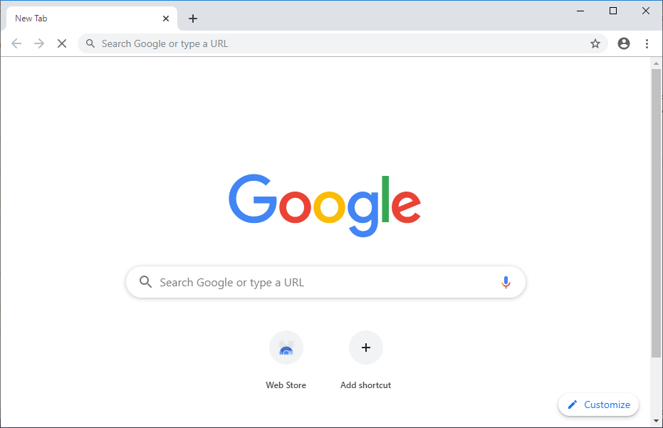

A Chromium window will open. Next, let's customize the browser's New Tab page.

Open `Add New Item` and select `MFC Class`.

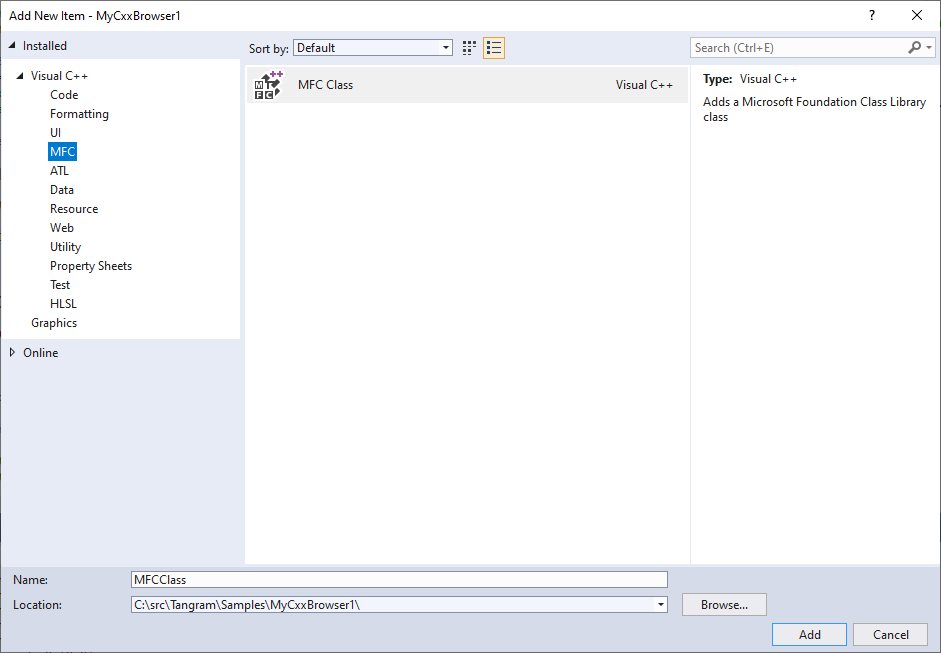

Create a Class named CMyFormView and based on CFormView.

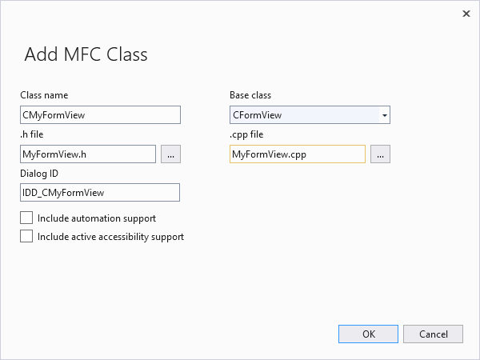

Open Resource View and find IDD_CMyFormView

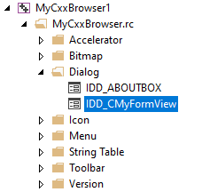

Add some text you want to appear on the New Tab Page.

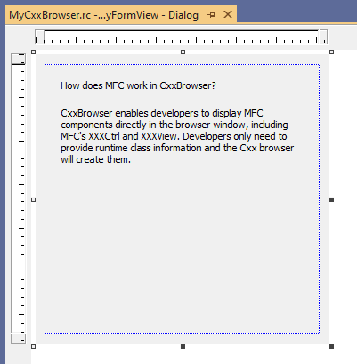

Add the following line in `InitInstance` to register this View.

```c++
m_mapInnerObjInfo[_T("main_panel")] = RUNTIME_CLASS(CMyFormView); // New line

if (!__super::InitInstance())
return false;
//CWinAppEx::InitInstance();
```

Add an override method `GetNTPXml` to the App class.

```c++
// Overrides
public:
	virtual BOOL InitInstance();
	virtual int ExitInstance();
	virtual CString GetNTPXml(); // New line
```

In cpp file

```c++
CString CMyCxxBrowserApp::GetNTPXml()
{
	return _T("Default_Mfc.xml");
}
```

Now we need a `Default_Mfc.xml` file, copy the following XML and save it to `C:\src\tangram_runtime_chromium_78_1.0.1\Default_Mfc.xml`.

```xml
<?xml version="1.0" encoding="utf-8" ?>
<ntp>
  <window>
    <node id='splitter' name='splitter' rows='1' cols='2' height='250,' width='350,100,' borderwidth='0' splitterwidth='2' middlecolor='RGB(180,180,180)'>
      <node id="main_panel" cnnid="MyCxxBrowser.host"></node>
      <node id="hostview"></node>
    </node>
  </window>
</ntp>
```

Build and run this MFC program again.


## Troubleshoots


If your browser looks like the picture above, Download this [app.manifest](https://raw.githubusercontent.com/TangramDev/CSharp-Browser/master/app.manifest) file to your project and rebuild.
