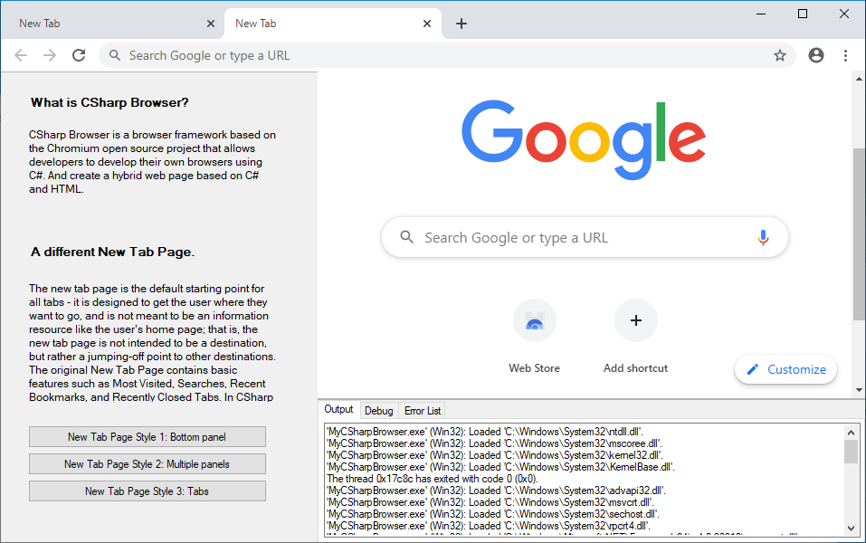
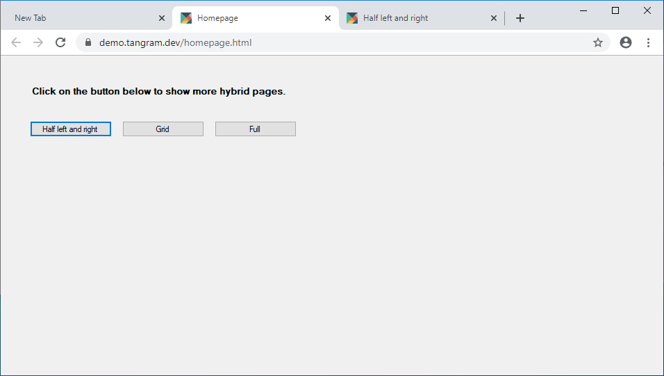
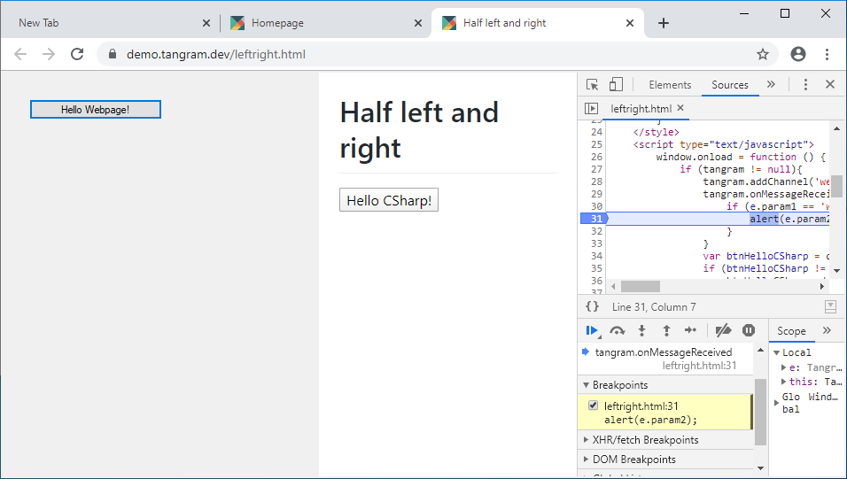
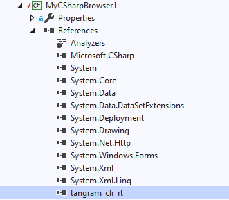
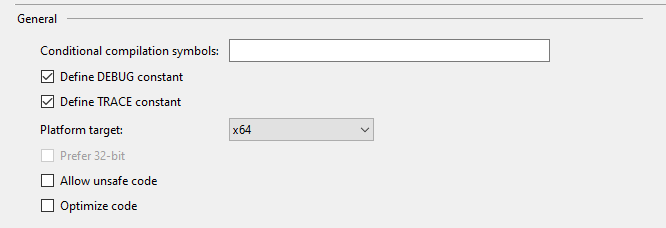
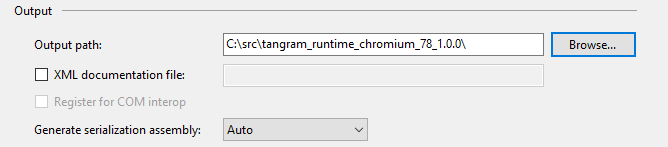
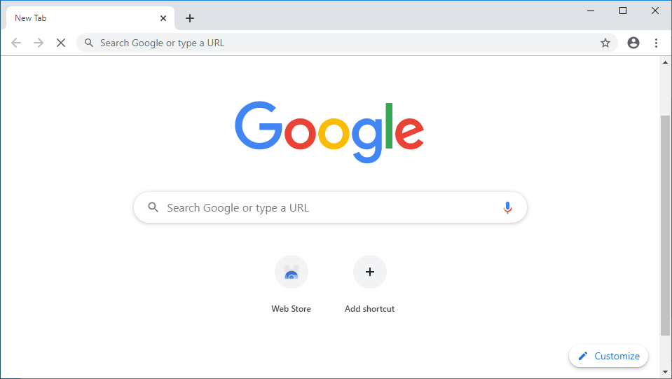
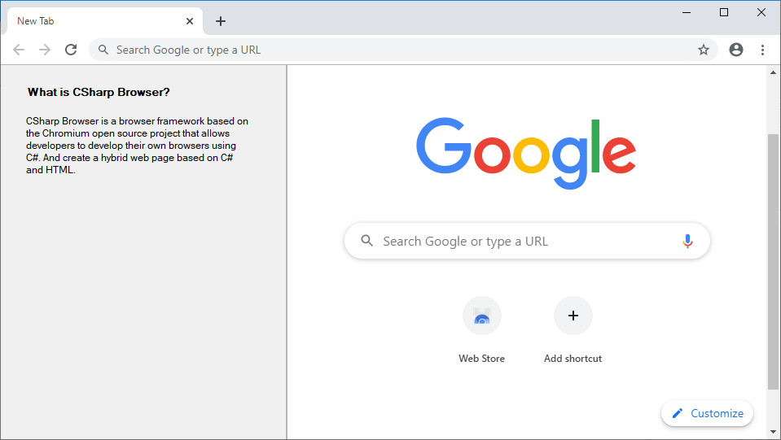
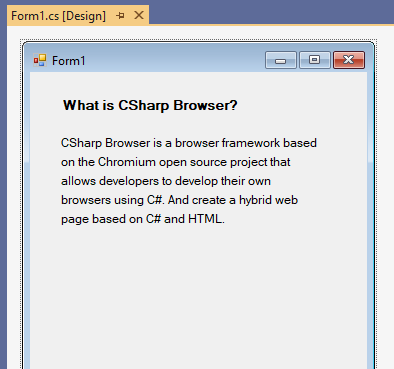

# CSharp-Browser
CSharp Browser is a browser development framework based on the Chromium open source project. The goal of the project is to enable .NET developers to build their own browsers using Microsoft.NET desktop technology and build hybrid web pages based on Microsoft.NET and Web. CSharp Browser has two editions, one is open-source, another is commercial, detail information please visit our GitHub and our website: https://www.tangram.dev.

## How to work?
CSharp Browser provides a new approach to desktop development using Chromium. You can download our preview package for experience.

Make sure your computer is Windows 7, Windows 8.1 or Windows 10, and has .NET Framework 4 or later. Extract the downloaded preview package to any location and run the demo MyCSharpBrowser1 to MyCSharpBrowser3. The source code of demos is located in the Sources directory.

We recommend that you experience our technology with Windows 10.



Customized New Tab Page in MyCSharpBrowser3.



CSharp Browser enable developers to host WinForm applications in browser tabs so that users can open WinForm applications by accessing URLs.



CSharp Browser connects C# and Webpage, enable developers to build user interfaces using C# and drive them using HTML and Javascript, include handle events and transfer data.

## How to build your own browser?
You first need a computer with Windows 10 and Visual Studio 2019 installed. The following Visual Studio installation items are essential. 

- .NET desktop development
- Desktop development with C++ (Required if develop with C++)
  - Visual C++ MFC for x86 and x64
  - C++/CLI support

Also make sure you have the latest version of the Windows SDK installed.

Download [tangram_runtime_chromium_78_1.0.0.zip](https://github.com/TangramDev/tangram_runtime_binaries/releases/download/v1.0.0/tangram_runtime_chromium_78_1.0.0.zip) and extract it to the `C:\src` directory.


Create a WinForm project (.NET Framework) using Visual Studio. And reference to `tangram_clr_rt.dll`(Located at `C:\src\tangram_runtime_chromium_78_1.0.0\`).



Change platform target to x64.



Update the Output path to `C:\src\tangram_runtime_chromium_78_1.0.0\`.



Use Tangram to take over the WinForm message loop.

```c#
using TangramCLR;

...

static void Main()
{
    Application.EnableVisualStyles();
    Application.SetCompatibleTextRenderingDefault(false);
    Application.Run(Tangram.Context); // !Important
}
```

Build and run the WinForm program.



A Chromium window will open. Next, we add the following code to customize the New Tab Page.

```c#
Tangram.UpdateNewTabPageLayout("Default.xml"); // New line
Application.Run(Tangram.Context);
```

UpdateNewTabPageLayout needs to pass in an XML string, similar to the following:

```xml
<?xml version="1.0" encoding="utf-8" ?>
<ntp>
  <window>
    <node id='splitter' name='splitter' rows='1' cols='2' height='250,' width='350,100,' borderwidth='0' splitterwidth='2' middlecolor='RGB(180,180,180)'>
      <node id="clrctrl" cnnid="MyCSharpBrowser.Form1,host"></node>
      <node id="hostview"></node>
    </node>
  </window>
</ntp>
```

Build and run the WinForm program again.



The Form1 will be displayed on the left side of the browser window. Take a look at Form1.



## Troubleshoots


If your browser looks like the picture above, add an app.manifest file to your project and uncomment the following lines, and rebuild.

```xml
<compatibility xmlns="urn:schemas-microsoft-com:compatibility.v1">
    <application>
        <!-- A list of the Windows versions that this application has been tested on
           and is designed to work with. Uncomment the appropriate elements
           and Windows will automatically select the most compatible environment. -->

        <!-- Windows Vista -->
        <supportedOS Id="{e2011457-1546-43c5-a5fe-008deee3d3f0}" />

        <!-- Windows 7 -->
        <supportedOS Id="{35138b9a-5d96-4fbd-8e2d-a2440225f93a}" />

        <!-- Windows 8 -->
        <supportedOS Id="{4a2f28e3-53b9-4441-ba9c-d69d4a4a6e38}" />

        <!-- Windows 8.1 -->
        <supportedOS Id="{1f676c76-80e1-4239-95bb-83d0f6d0da78}" />

        <!-- Windows 10 -->
        <supportedOS Id="{8e0f7a12-bfb3-4fe8-b9a5-48fd50a15a9a}" />

    </application>
</compatibility>
```

